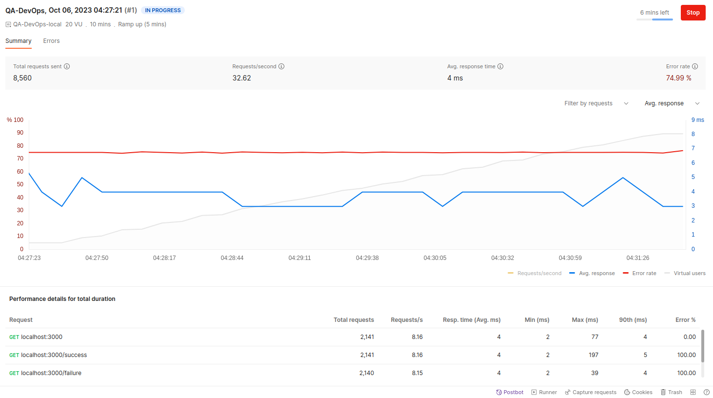

# DevOps Principles and Practices for QA Professionals

## Requirements

- [Docker](https://www.docker.com/)
- [Postman](https://www.postman.com/)
- Newman (Postman CLI)
- [Node.js](https://nodejs.org/en/) version 12 or higher
- Maven version 3.6.3 or higher
- Java version 11 or higher

## Postman performance testing

