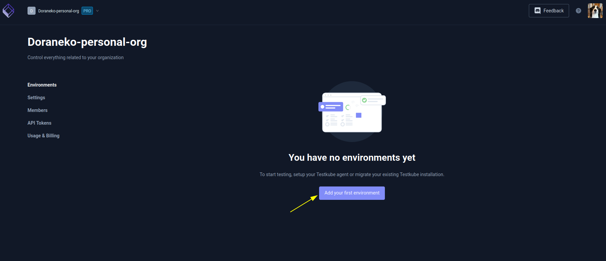
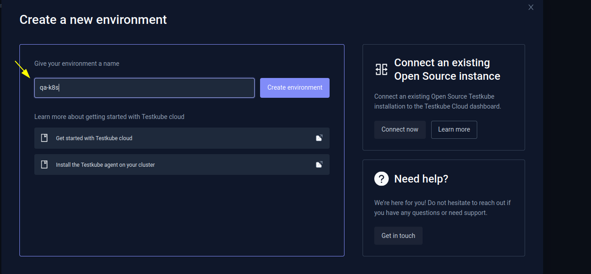
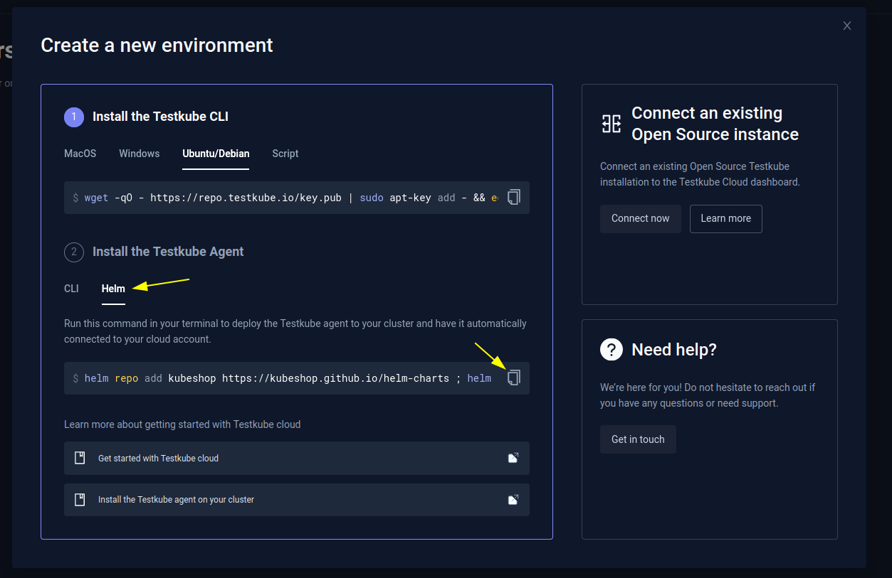
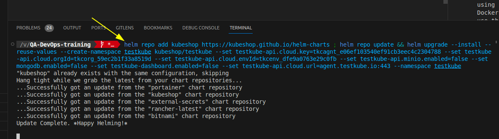
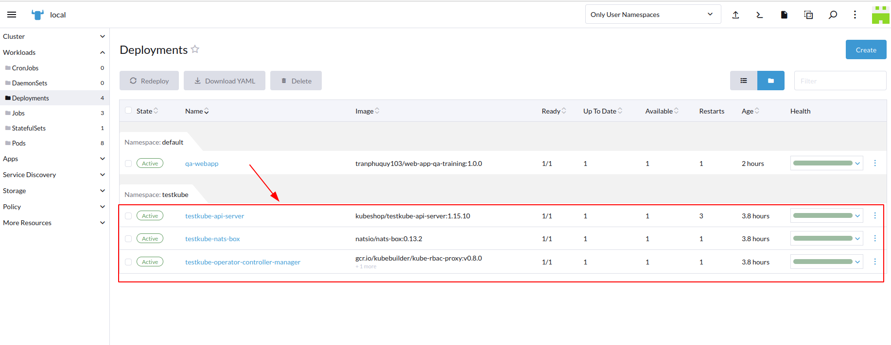
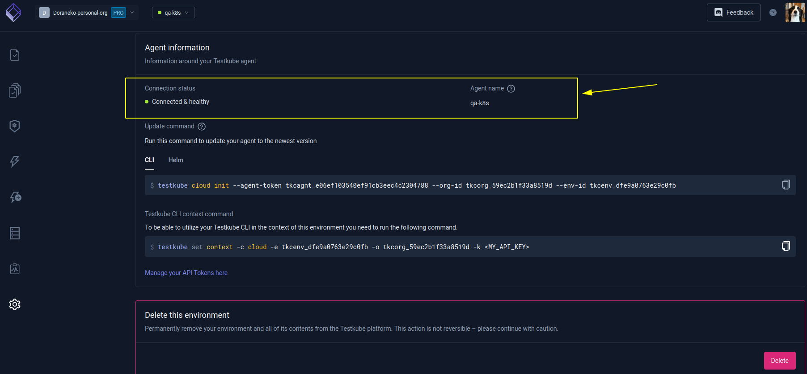
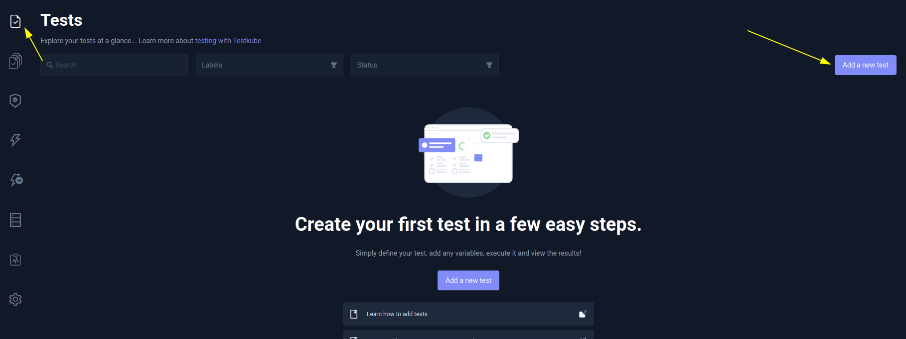
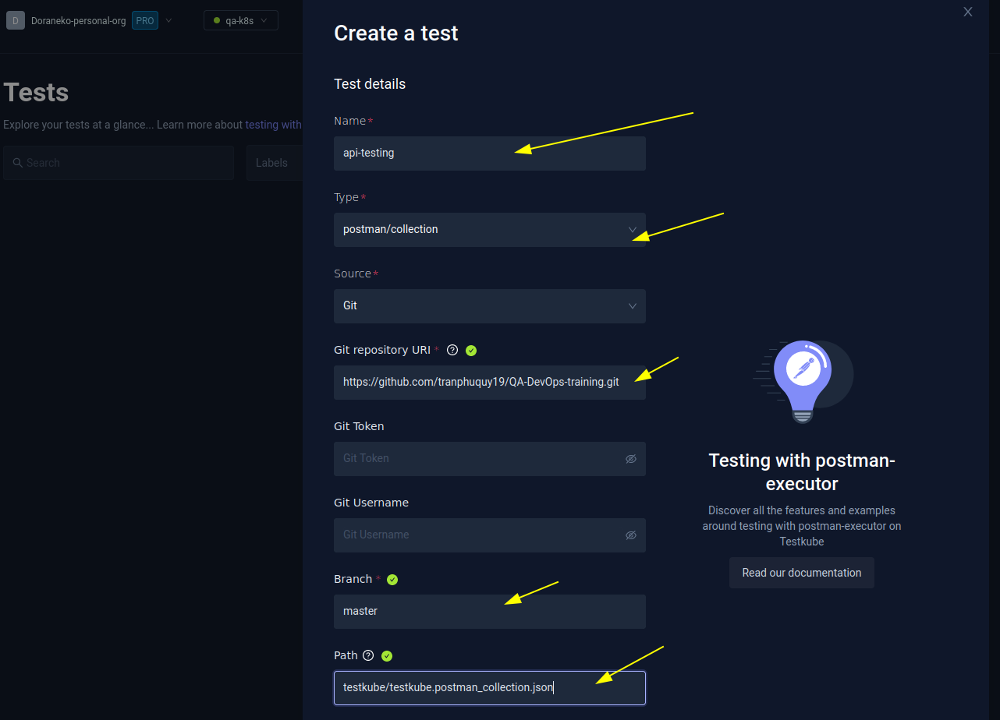
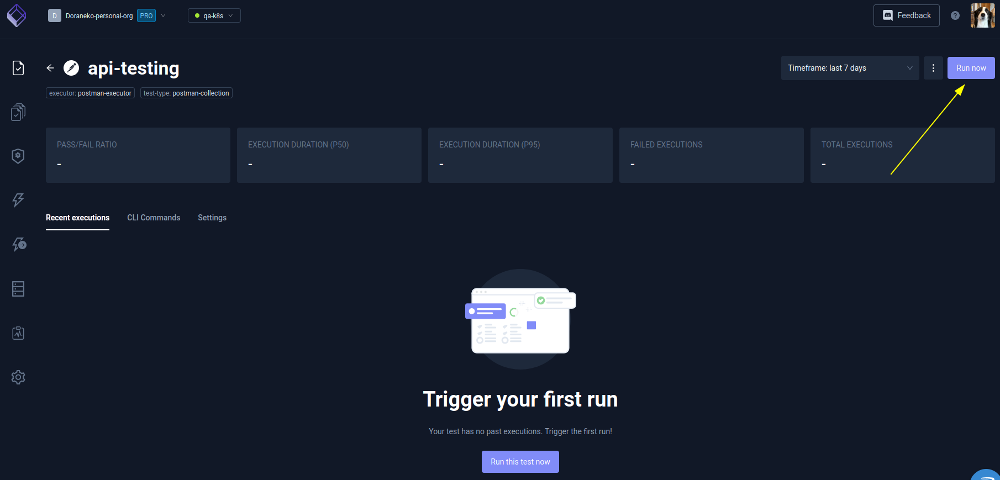
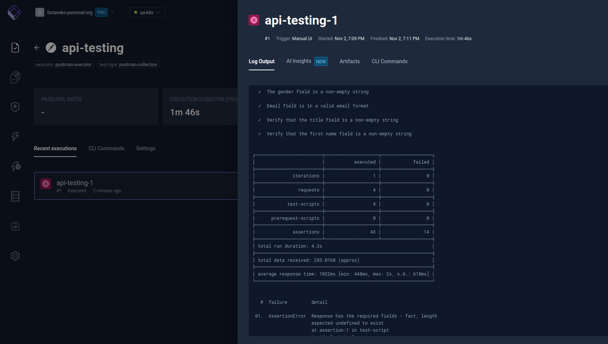

# Kubernetes Introduction - How to deploy a web application to Kubernetes and test it with Postman/Newman

## Table of contents
- [Kubernetes Introduction - How to deploy a web application to Kubernetes and test it with Postman/Newman](#kubernetes-introduction---how-to-deploy-a-web-application-to-kubernetes-and-test-it-with-postmannewman)
  - [Table of contents](#table-of-contents)
  - [Prerequisites](#prerequisites)
  - [Step by step](#step-by-step)
    - [1. Create a folder for this session](#1-create-a-folder-for-this-session)
    - [2. Create a Vagrantfile with the following content](#2-create-a-vagrantfile-with-the-following-content)
    - [3. Start the VM](#3-start-the-vm)
    - [4. In the VM, clone this repository](#4-in-the-vm-clone-this-repository)
    - [5. Change directory to `postman-api-testing`](#5-change-directory-to-postman-api-testing)
    - [6. Build and publish the docker image](#6-build-and-publish-the-docker-image)
      - [6.1 Build the docker image](#61-build-the-docker-image)
      - [6.2 Publish the docker image to docker hub](#62-publish-the-docker-image-to-docker-hub)
    - [7. Create a k3d cluster](#7-create-a-k3d-cluster)
    - [8. Deploy Rancher to the cluster](#8-deploy-rancher-to-the-cluster)
    - [9. Deploy the web application to the cluster](#9-deploy-the-web-application-to-the-cluster)
    - [10. Test the web application with Testkube.io](#10-test-the-web-application-with-testkubeio)
    - [11. Create a new test (Postman api test)](#11-create-a-new-test-postman-api-test)
    - [12. Run the test](#12-run-the-test)
    - [13. Result](#13-result)
  - [References](#references)


## Prerequisites

- Git [https://git-scm.com/](https://git-scm.com/)
- VirtualBox [https://www.virtualbox.org/](https://www.virtualbox.org/)
- Vagrant [https://www.vagrantup.com/downloads](https://www.vagrantup.com/downloads)
- Docker [https://www.docker.com/](https://www.docker.com/)
- Node.js version 16 or higher [https://nodejs.org/en/](https://nodejs.org/en/)
- Postman [https://www.postman.com/](https://www.postman.com/)
- Newman (Postman CLI) [https://www.npmjs.com/package/newman](https://www.npmjs.com/package/newman)
- Helm [https://helm.sh/](https://helm.sh/)
- k3d [https://k3d.io/](https://k3d.io/)
- kubectl [https://kubernetes.io/docs/tasks/tools/](https://kubernetes.io/docs/tasks/tools/)

Note: Git, Docker, K3d, kubectl, Helm are already installed in the VM.

## Step by step

### 1. Create a folder for this session

```bash
mkdir session3
cd session3
```

### 2. Create a Vagrantfile with the following content

```rb
Vagrant.configure("2") do |config|
  config.vm.box = "tranphuquy19/ubuntu2204desktop-k3d-k8s-docker"
  config.vm.provider :virtualbox do |v|
    v.gui = true
    v.memory = 8192
    v.cpus = 4
    v.customize ["modifyvm", :id, "--monitorcount", "1"]
  end
end
```

Save the file with name `Vagrantfile`

Note:
  - The VM needs at least 8GB of RAM and 4 CPUs to run smoothly.


### 3. Start the VM

```bash
vagrant up
```

This will take a while to download the box and start the VM. After the VM is started, you can login to the VM with username/password: `vagrant/vagrant`. The VM is provisioned with Docker, Kubernetes, k3d, kubectl, Helm, git.

> **Slowly???**: You can download directly the box from Google Drive [https://drive.google.com/file/d/1Vwvt9udTXMDKSKtStAU0IvUMWnnQUDzM/view?usp=sharing](https://drive.google.com/file/d/1Vwvt9udTXMDKSKtStAU0IvUMWnnQUDzM/view?usp=sharing)

Then add the box to vagrant

```bash
vagrant box add ubuntu2204desktop-k3d-k8s-docker-1.0.0.box --name tranphuquy19/ubuntu2204desktop-k3d-k8s-docker
```

And run `vagrant up` again.

### 4. In the VM, clone this repository

```bash
cd Desktop
git clone https://github.com/tranphuquy19/QA-DevOps-training.git
```

### 5. Change directory to `postman-api-testing`

```bash
cd postman-api-testing
```

### 6. Build and publish the docker image

#### 6.1 Build the docker image

```bash
docker build -f Dockerfile -t tranphuquy103/web-app-qa-training:1.0.0 .
```

This will build the docker image with name `tranphuquy103/web-app-qa-training` and tag `1.0.0`. `tranphuquy103` is my docker hub username, you can change it to your docker hub username. You can change the tag to any tag you want.

#### 6.2 Publish the docker image to docker hub

First, login to docker hub. You will be prompted for username and password. How to login to docker hub: [https://www.howtogeek.com/devops/how-to-login-to-docker-hub-and-private-registries-with-the-docker-cli/](https://www.howtogeek.com/devops/how-to-login-to-docker-hub-and-private-registries-with-the-docker-cli/)

```bash

```bash
docker login
```

Then, push the docker image to docker hub

```bash
docker push tranphuquy103/web-app-qa-training:1.0.0
```

### 7. Create a k3d cluster

```bash
# Cd to the folder testkube in the repository
cd testkube
# Create a k3d cluster using the config file
k3d cluster create -c k3d-config.yaml
```

**How to stop the cluster**: `k3d cluster stop local`<br/>
**How to start the cluster**: `k3d cluster start local`<br/>
**How to delete the cluster**: `k3d cluster delete local`<br/>

### 8. Deploy Rancher to the cluster

```bash
# Cd to the folder testkube/rancher in the repository
cd rancher
# Add the rancher helm repo
helm repo add rancher-latest https://releases.rancher.com/server-charts/latest
# Install rancher to the cluster
helm install rancher rancher-latest/rancher \
   --namespace cattle-system \
   --create-namespace \
   --values=values.yaml
# Install Rancher service
kubectl apply -f rancher.svc.yaml
```

This will take a while to install Rancher to the cluster. After Rancher is installed, you can access Rancher at [https://localhost:8901](https://localhost:8901). You will be prompted to create an admin password. After that, you can login to Rancher with username/password: `admin/mgplL6DTziwhJ2cf`

### 9. Deploy the web application to the cluster

```bash
# Cd to the folder testkube/web-app in the repository
cd web-app
# Deploy the web application to the cluster
kubectl apply -f app.yaml
```

Setup DNS server pointing to the cluster. Ex: http://qa-webapp.doracoder.dora/login

### 10. Test the web application with Testkube.io

Sign up for a free account at [https://testkube.io](https://testkube.io). Then create a new environment.













### 11. Create a new test (Postman api test)





### 12. Run the test



### 13. Result



## References

1. https://devopsvn.tech/
2. https://www.slideshare.net/EdurekaIN/what-is-kubernetes-kubernetes-introduction-kubernetes-tutorial-for-beginners-edureka
3. https://www.slideshare.net/Sparkbit/kubernetes-introduction-133390463
